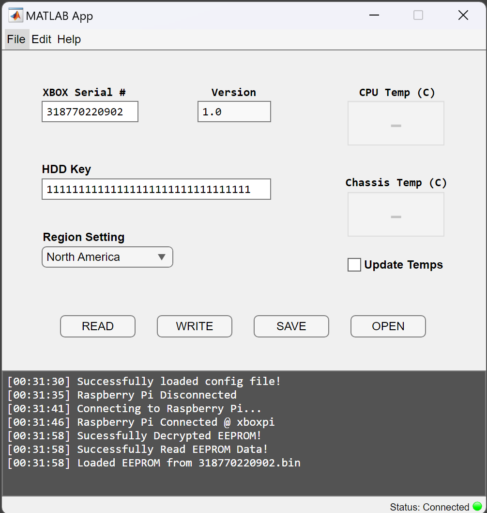

# Xbox-Pi Project

## Project Overview
The Xbox-Pi project aims to enhance the functionality and extend the lifespan of the original Xbox console by leveraging the Raspberry Pi and MATLAB's native integration tools. The project focuses on interfacing with the Xbox's I2C Bus to address common hardware issues and introduce new features.

## Project Objectives
1. **Hard Drive Replacement and Recovery**
   - Address the issue of hard drive failures due to age
   - Unlock and replace the drives, which are locked to the console with a unique key
   - Extend the console's lifespan by enabling hard drive replacement

2. **Region Modification**
   - Modify the region information (NTSC, NTSC-J, PAL) of the Xbox
   - Allow compatibility with different TV systems
   - Enable the console to read discs from any region

3. **System Temperature Monitoring**
   - Actively monitor the Xbox's system temperatures
   - Prevent overheating and ensure optimal performance during extended use
   - Preserve the aging console by monitoring the thermal conditions

## Hardware and Software Requirements
- Raspberry Pi compatible with MATLAB libraries: Central hardware interface
- MATLAB and Supported Add-Ons: Used for computation, visualization, and Pi integration
  - **Important**: Raspberry Pi libraries must be installed for proper functionality
- Additional Components: I2C cables

## Project GUI
The project's main window interface is shown below:

